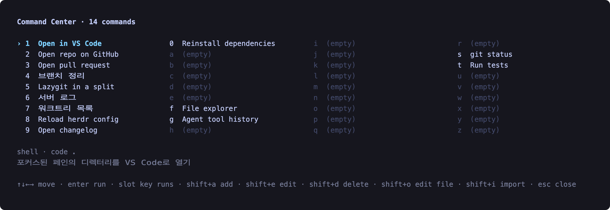
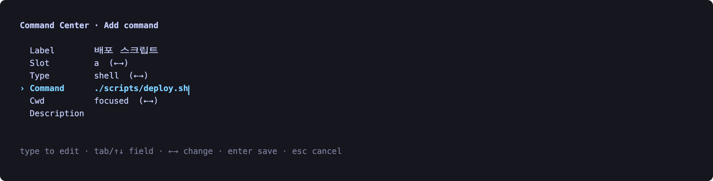
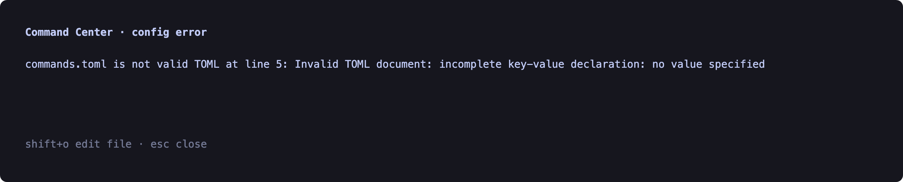
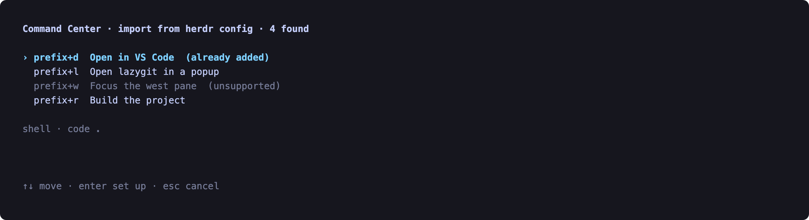

# Command Center

[English](README.md) ｜ [한국어](README.ko.md)

`cdragon.command-center`는 수많은 prefix 키 조합을 **키 하나**로 바꿔주는 herdr
플러그인입니다. 그 키를 누르면 등록해 둔 커맨드 목록이 팝업으로 뜹니다. 방향키로
옮겨서 Enter를 누르거나, 옆에 붙은 슬롯 키를 바로 누르면 실행됩니다.



모든 커맨드는 슬롯을 가집니다: `1`–`9`, `0`, 그다음 `a`–`z`. `s`를 누르면
git status 커맨드가 바로 실행됩니다 — 방향키도, 그게 어느 prefix 키였는지 떠올릴
필요도 없습니다. 그리드 아래 줄은 선택한 커맨드가 실제로 무엇을 하는지 실행 전에
보여줍니다.

그리드는 슬롯 36개를 모두 그리며, 각 열을 위에서 아래로 채웁니다. 아직 비어 있는
슬롯은 테마의 bright-black — 테마 제작자가 이미 배경 바로 옆에 두라고 골라둔 색 —
으로 `(empty)`라고 표시되므로, 무엇이 차 있고 무엇이 남았는지 한눈에 들어옵니다.
빈 슬롯에서 `Enter`를 누르면 그 슬롯이 미리 지정된 추가 폼이 열립니다.

밝은 터미널에서는 대신 bright-white를 써서, 그쪽 배경으로도 똑같이 물러납니다.
어느 쪽인지는 `COLORFGBG`로 판별하고, 알려주지 않는 터미널은 어두운 쪽으로
간주합니다.

핵심은 외우지 않아도 된다는 점입니다. herdr 플러그인이 늘어날수록 각자
`prefix+<키>`를 하나씩 차지하는데, 어느 순간부터 어떤 키가 무엇인지 기억할 수
없게 됩니다. Command Center는 그 전부를 문 하나로 모읍니다.

## 동작 방식

팝업은 **커맨드를 직접 실행하지 않습니다.** 커맨드를 선택하면 팝업은 그 커맨드를
분리된(detached) 러너 프로세스에 넘기고 종료하는데, 이 종료가 곧 팝업이 닫히는
동작입니다. 러너는 팝업 프로세스 id가 사라질 때까지 기다리고, herdr가 팝업을
정리하고 포커스를 되돌릴 시간으로 120ms를 더 기다린 뒤에 실행합니다.

이 순서는 겉치레가 아닙니다. herdr는 `plugin action invoke`를 **지금 포커스된**
페인 기준으로 해석하고, 팝업이 화면을 점유한 동안에는 UI 작업을 `ui_busy`로
거부합니다. 팝업이 닫히기 전에 실행하면 커맨드가 팝업 자신을 대상으로 잡히거나
아예 거부됩니다. 그래서 러너는 `ui_busy` 거부에 대해 재시도까지 합니다.

## 설치

Node.js 22+ 와 herdr 0.7.5+ 가 필요합니다. `herdr plugin install` 이 `npm ci` 를 대신 실행합니다.

```bash
herdr plugin install speardragon/herdr-command-center --yes
```

로컬 개발 시:

```bash
herdr plugin link /path/to/herdr-command-center
```

그리고 `~/.config/herdr/config.toml`에 키 하나만 매핑합니다:

```toml
[[keys.command]]
key = "prefix+a"
type = "plugin_action"
command = "cdragon.command-center.open"
description = "Open Command Center"
```

비어 있는 키면 무엇이든 됩니다. herdr 기본값(`prefix+c`는 `new_tab`, `prefix+e`는
`edit_scrollback` 등)이나 다른 플러그인과 겹치지 않는지만 확인하세요. 재시작 없이
적용하려면:

```bash
herdr server reload-config
```

## 키

| 키 | 목록에서 | 추가/수정 폼에서 |
| --- | --- | --- |
| `1`–`9`, `0`, `a`–`z` | 해당 슬롯의 커맨드 실행 | 포커스된 텍스트 필드에 입력됨 |
| `↑` `↓` `←` `→` | 그리드 안에서 이동 | 이전 / 다음 필드 |
| `Tab` / `Shift-Tab` | — | 다음 / 이전 필드 |
| `Enter` | 선택한 커맨드 실행, 빈 슬롯이면 그 자리에 추가 | 저장 |
| `shift+a` | 커맨드 추가 | — |
| `shift+e` | 선택한 커맨드 수정 | — |
| `shift+d` 다음 `y` | 선택한 커맨드 삭제 | — |
| `shift+o` | `commands.toml`을 에디터로 열기 | — |
| `shift+i` | herdr 설정에서 가져오기 | — |
| `Space` | — | `Slot`·`Type`·`Cwd` 값 변경 |
| `Backspace` | — | 마지막 글자 삭제 |
| `Esc` | 팝업 닫기 | 취소하고 목록으로 |
| `Ctrl-C` | 팝업 닫기 | 팝업 닫기 |

**소문자·숫자는 실행, 대문자는 동작입니다.** 커맨드를 실행하는 키는 `slot`으로
커맨드에 함께 저장되므로, 목록 순서를 바꿔도 변하지 않습니다 — `d`는 언제나
`d` 슬롯의 커맨드를 실행합니다. 슬롯 36개를 모두 쓸 수 있고, 아직 비어 있더라도
36개 전부가 화면에 나옵니다.

여기서 두 가지가 따라옵니다. `j`·`k`가 슬롯이 되었으니 이동은 방향키로만 하고,
`q`가 슬롯이 되었으니 팝업은 `Esc`로 닫습니다.

팝업을 벗어나지 않고 `shift+a`로 바로 추가할 수 있습니다. `Tab`으로 필드를 옮기고,
`←`/`→`로 `Slot`·`Type`·`Cwd`를 바꾸고, `Enter`를 누르면 `commands.toml`에 기록됩니다.

깜빡이는 커서가 지금 타이핑되는 필드를 알려주므로 짐작할 필요가 없습니다 — 그냥
치면 됩니다. `Slot`·`Type`·`Cwd`에는 일부러 커서를 두지 않았습니다. 방향키로 바꾸는
필드인데 커서가 있으면 되지도 않는 타이핑을 약속하는 셈이니까요.



## 설정 파일

> `commands.json`을 쓰던 버전에서 올라오셨다면, 팝업을 처음 열 때 `commands.toml`로
> 변환하고 원본은 `commands.json.bak`으로 이름만 바꿔 둡니다. 삭제하지 않습니다.

팝업이 편집하는 내용은 전부 TOML 파일 하나에 들어 있고, 이 파일은 직접 손으로
고치는 것도 전제로 하고 있습니다. 팝업에서 `shift+o`를 누르거나, 액션을 직접 실행하세요:

```bash
herdr plugin action invoke edit-config --plugin cdragon.command-center
```

경로:

```bash
herdr plugin config-dir cdragon.command-center
# → <그 디렉터리>/commands.toml
```

```toml
schema_version = 1
editor = ["code --new-window", "nvim"]

# 자주 쓰는 것들
[[commands]]
slot = "1"
label = "Open in VS Code"
type = "shell"
command = "code ."
cwd = "focused"

[[commands]]
slot = "s"
label = "git status"
type = "pane"
command = "git status --short --branch"

[[commands]]
slot = "f"
label = "File explorer"
type = "plugin_action"
command = "ray.file-explorer.open"

# [[commands]]                 <- commented out for now
# slot = "g"
# label = "Lazygit"
# type = "pane"
# command = "lazygit"
```

플래그는 별도 항목이 아니라 한 항목 안에 넣습니다:

```toml
editor = ["code --new-window", "nvim", "vim"]
```

플래그가 붙은 첫 항목을 포함해 세 개의 후보입니다.

새로 만들어지는 `commands.toml`에는 플러그인이 아는 에디터가 전부 들어갑니다 —
`code`, `cursor`, `zed`, `subl`, `nvim`, `vim`, `hx`, `nano`. 찾아내야 하는
목록이 아니라 지워서 줄이는 목록입니다. `PATH`에 없는 항목은 선택 화면에
뜨기 전에 걸러집니다. 설치되지 않은 에디터를 고르면 `command not found`가
detached 프로세스로 흘러가 아무 일도 안 일어난 것처럼 보이기 때문입니다.
인자가 붙은 항목은 `$VISUAL`·`$EDITOR`와 마찬가지로 그대로 신뢰하며 걸러내지
않습니다.

매번 묻는 게 싫으면 항목을 하나만 남기면 됩니다.

| 필드 | 의미 |
| --- | --- |
| `schema_version` | 항상 `1`. |
| `editor` | 후보 에디터 목록, 한 줄당 커맨드 하나. 첫 실행 때 전부 채워집니다. `PATH`에 없는 항목을 걸러낸 뒤, 하나만 남으면 바로 열리고 여러 개면 팝업이 무엇을 열지 묻습니다. 비워두면 `$VISUAL`, `$EDITOR`, `PATH` 순으로 자동 감지합니다. |
| `id` | 고정 식별자. 생략하면 label에서 만들어집니다(한글 label도 읽을 수 있는 id가 됩니다). |
| `slot` | 실행 키: `1`-`9`, `0`, `a`-`z` 중 하나. 생략하면 비어 있는 다음 슬롯이 배정됩니다. |
| `label` | 팝업에 보이는 이름. 최대 80자. |
| `type` | `shell`, `pane`, 또는 `plugin_action`. |
| `command` | `shell`과 `pane`은 한 줄 셸 커맨드, `plugin_action`은 `<plugin_id>.<action_id>`. |
| `cwd` | `focused`(기본), `workspace`, 또는 절대 경로. `plugin_action`에서는 무시됩니다. |
| `description` | 목록 아래에 보여줄 한 줄 설명(선택). |

> 파일은 항상 원자적으로 기록되고, 팝업을 연 뒤 파일이 디스크에서 바뀌었다면 저장을
> 거부합니다. 팝업을 열어둔 채 VS Code에서 편집해도 그 편집이 사라지지 않습니다.
>
> **주석은 유지됩니다.** 팝업은 파일을 다시 렌더링하지 않고 `[[commands]]` 블록만
> 교체·삭제·추가합니다. 헤더, 빈 줄, 블록 사이 주석, 주석 처리해 둔 블록은 바이트
> 단위로 그대로 남고, 건드리지 않은 커맨드는 원래 서식을 유지합니다. 예외는 하나:
> 팝업에서 수정한 블록 *안쪽*의 주석은 그 블록이 다시 쓰이므로 사라집니다.
>
> 형식이 깨진 파일은 무엇이 문제인지 알려주는 에러 화면으로 열리고, 그 화면에서도
> `shift+o`로 고치러 갈 수 있습니다. 깨진 파일을 덮어쓰지는 않습니다.



### 실행 결과가 표시되는 곳

| `type` | 동작 |
| --- | --- |
| `shell` | 백그라운드에서 분리되어 해석된 `cwd`에서 실행됩니다. 자체 창을 여는 것들에 적합합니다 — `code .`, `gh browse`. 표준 출력은 보이지 않습니다. |
| `pane` | 보고 있던 페인에 입력되어 그 자리에서 실행되므로 출력이 보입니다. `echo`, `git status`, `npm test` 같은 것에 적합합니다. |
| `plugin_action` | 다른 herdr 플러그인의 액션을 `<plugin_id>.<action_id>` 형태로 호출합니다. |

> 포커스된 페인에서 agent가 돌고 있으면 `pane` 커맨드는 거부됩니다. 그 경우 herdr가
> 명령을 셸이 아니라 **agent에게 프롬프트로** 넣기 때문입니다. 의도하지 않은 프롬프트를
> 보내는 대신 알림으로 이유를 알려줍니다.

### 이미 갖고 있는 설정 가져오기

`shift+i`를 누르면 Command Center가 `~/.config/herdr/config.toml`의 `[[keys.command]]`
항목 — 이 플러그인이 대체하려는 그 prefix 키바인딩들 — 을 읽어서 보여줍니다. 하나를
고르면 추가 폼이 미리 채워진 채로 열리므로, 슬롯은 직접 고르고 저장 전에 label도
고칠 수 있습니다. 이미 추가된 항목은 표시되고, herdr 타입에 대응하는 게 없는 항목은
조용히 버려지는 대신 이유와 함께 나열됩니다.



### herdr가 할 수 있는 건 다 됩니다

`type`을 `shell`·`pane`·`plugin_action` 셋으로만 둔 이유는, `shell` 커맨드가 `herdr`
CLI를 호출할 수 있어서 herdr가 하는 일은 전부 가능하기 때문입니다:

```toml
[[commands]]
label = "Lazygit in a split"
type = "shell"
command = "herdr plugin pane open --plugin ray.file-explorer --entrypoint explorer --placement split"
```

## 액션

| 액션 | 설명 |
| --- | --- |
| `herdr plugin action invoke open --plugin cdragon.command-center` | 팝업 열기 |
| `herdr plugin action invoke edit-config --plugin cdragon.command-center` | `commands.toml`을 에디터로 열기 |

## 문제 해결

**키를 눌러도 아무 일도 안 납니다.** 이미 팝업이 열려 있으면 herdr가 `ui_busy`로
응답합니다. `herdr plugin log --plugin cdragon.command-center`로 액션 자체의 출력을
확인하세요.

**팝업은 닫혔는데 실행이 안 됐습니다.** 러너는 분리된 프로세스라 터미널이 없어서
JSONL 로그를 남깁니다:

```bash
find ~/.config/herdr -name run.log -path '*command-center*' -exec tail -20 {} +
```

각 줄에는 팝업이 닫힌 것을 확인했는지(`popup-closed`), 무엇을 시작했는지
(`shell` / `pane` / `plugin_action` / `open-config`), 실패했다면 그 내용(`failed`,
`plugin_action_failed`)이 남습니다.

**셸 커맨드가 엉뚱한 디렉터리에서 실행됩니다.** `cwd: "focused"`는 키를 누른 시점에
포커스되어 있던 페인을 씁니다. herdr가 그 페인의 cwd를 주지 않으면 workspace cwd,
그다음 홈 디렉터리로 넘어갑니다.

## 라이선스

MIT
